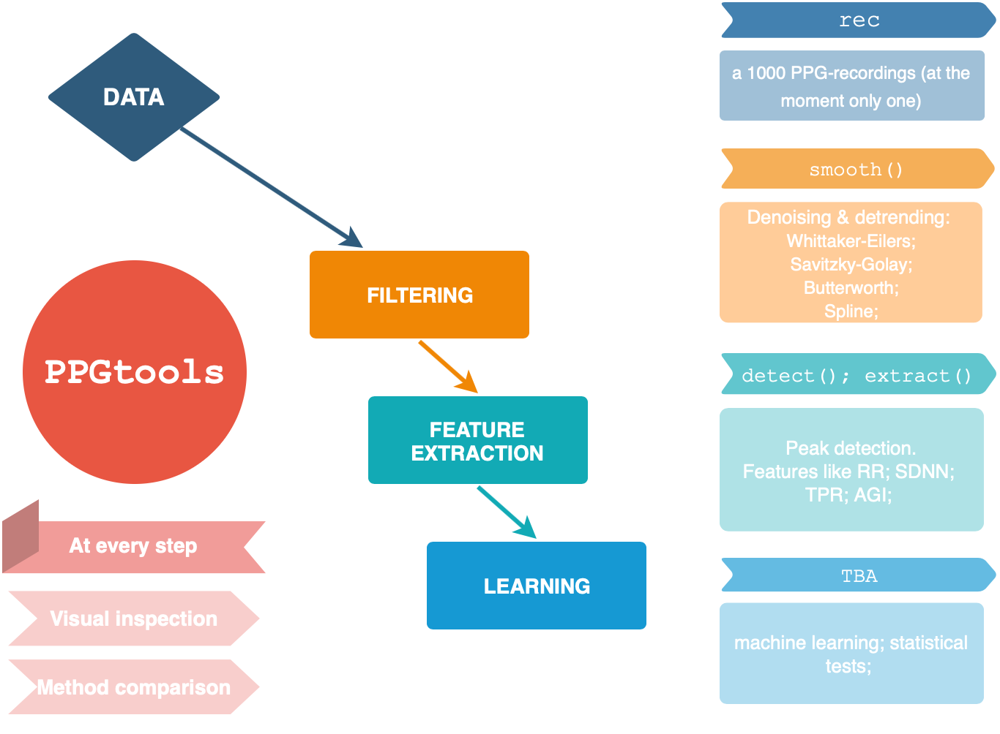

```{r setup, include=FALSE}
knitr::opts_chunk$set(echo = TRUE)
```

# PPGtools
To install ` PPGtools` on your computer, run:

```{r eval = FALSE}
# install package from GitHub repository
devtools::install_github("GerbrichFerdinands/PPGtools", build = TRUE)
```


## Package structure


## Step 0. Prepare data 

## Example
```{r}
library(PPGtools)

# prepare data
raw_signal <- prepInput(rec, channel = "Green", tstart = 20, tstop = 40)
``` 


## Step 1. Filter data
```{r}
# smooth series z
lambda <- matrix(10^(seq(1, 7, 2)), dimnames = list(paste0('lambda_', 1:4), NULL))

z <- smoothWE(raw_signal = raw_signal, lambda = lambda, d=2, uni = TRUE)
```


## Step 2. Plot results
```{r}
# plot results
title <- "Uniform sampling assumed, d=2, lambda = 10, 10^3, 10^5, 10^7"
plotLambda(raw_signal = raw_signal, z = z, title = title)
```

## Other 
Detrending how to detrend etc can be found in the rscripts in 'manuscript figures and matrices' folder. 